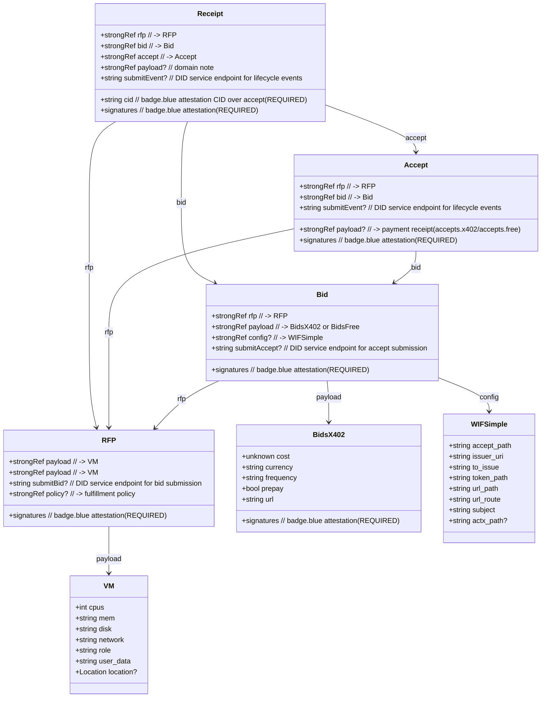
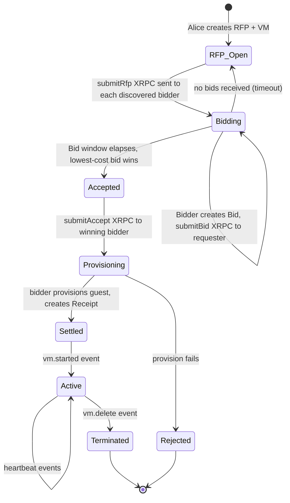
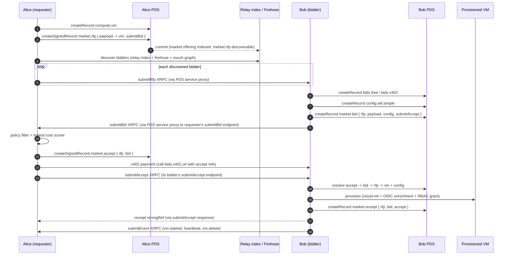
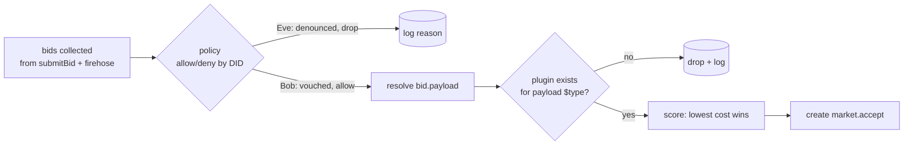
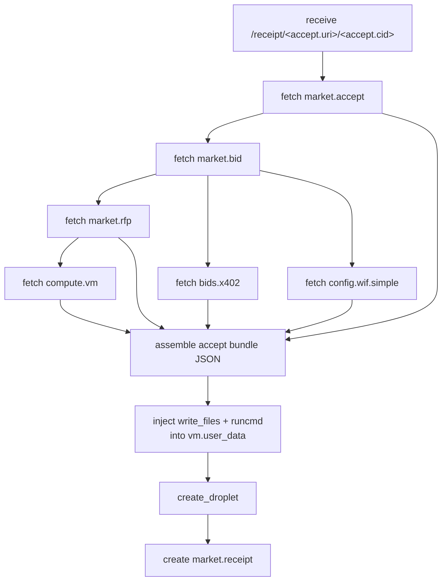
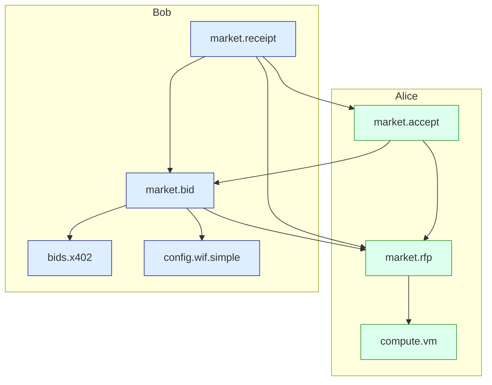
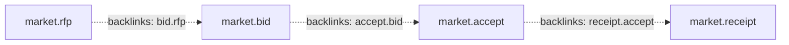

# Compute Contract

> https://john.leaflet.pub/3mletyxaie22o

- Alice wants compute. She creates a VM spec (cpus, mem, disk, cloud-init
  `user_data`) and publishes it as a `compute.vm` record.
- Alice wraps the VM record in a `market.rfp` envelope. The RFP is the
  domain-tagged record bidders and indexers route on; the VM record is the
  inner payload.
- Alice has vouched for Bob (a trusted provider). She has denounced Eve.
- Alice publishes the RFP to the network. Bidders discover it via relay
  indices, firehose watches, or direct `submitRfp` XRPC calls.
- Bob and Eve each create a `market.bid` referencing Alice's RFP, along
  with settlement terms and WIF config. Both submit bids to Alice's
  `submitBid` endpoint.
- Alice's policy engine filters bids: Eve is denied (denounced DID),
  Bob passes. Alice scores Bob's bid (lowest cost) and accepts it by
  creating a `market.accept`.
- Alice pays Bob via x402 (calling the URL in Bob's `bids.x402` record).
- Bob resolves the chain, provisions the guest (container or VM) with the
  cloud-init `user_data`, and publishes a `market.receipt`.
- The receipt strongRefs RFP → Bid → Accept. Alice verifies it before
  trusting the provisioned guest.

All cross-record references use `com.atproto.repo.strongRef`
(`{$type, uri, cid}`), so the chain is content-addressed end-to-end.

## Concepts

| Term | Definition |
|------|------------|
| **AT URI** | `at://` URI identifying a record: `at://<did>/<collection>/<rkey>`. The unique address of any record in the network. |
| **CID** | Content IDentifier — a cryptographic hash of the record content. Paired with an AT URI, forms a content-addressed pointer (`strongRef`). |
| **strongRef** | `{$type: "com.atproto.repo.strongRef", uri, cid}` — a tamper-proof pointer to a specific version of a record. Every cross-record link uses this. |
| **DID** | Decentralized IDentifier. `did:plc:<key>` for most actors; `did:web:<domain>` for services reachable at a domain. |
| **PLC** | `did:plc` — a DID method where the DID document is hosted at `plc.directory`. The most common DID method on AT Protocol. |
| **NSID** | Namespaced Identifier — a reversed-domain string identifying a record type or XRPC method, e.g. `com.publicdomainrelay.temp.market.rfp`. |
| **XRPC** | AT Protocol's HTTP-based RPC layer. Records are created via `com.atproto.repo.createRecord`; custom procedures (like `submitBid`) are service-proxied through PDS endpoints. |
| **PDS** | Personal Data Server — each actor's AT Protocol server holding their repo (records) and handling auth. |
| **Firehose** | `com.atproto.sync.subscribeRepos` / Jetstream — a public WebSocket stream of all repo commits. Used for real-time discovery of new records. |
| **x402** | HTTP 402 Payment Required protocol. Used for settlement — the requester pays the bidder before/during provisioning. |
| **OIDC** | OpenID Connect. Used for workload identity — the provisioned VM authenticates to the provider's token issuer. |
| **WIF** | Workload Identity Federation — the bidder's config telling the requester how the VM will obtain scoped auth tokens. |
| **RBAC** | Role-Based Access Control — the provider's policy controlling what provisioned VMs are authorized to do. |
| **badge.blue** | An attestation protocol. Every requester-authored record carries a `network.attested.signature` — an inline signature by the author's attestation key, published in their DID document. |

## References

- https://github.com/publicdomainrelay/publicdomainrelay — monorepo: bidder, requester, relay, compute providers, cloud-init
- https://github.com/publicdomainrelay/atproto-reverse-proxy — fedproxy-client (guest-side tunnel agent)
- https://github.com/publicdomainrelay/compute-contract — this repo (lexicons, docs, examples)

## Flow

End-to-end walkthrough of the RFP → Bid → Accept → Receipt lifecycle as
expressed by the lexicons under `lexicons/com/publicdomainrelay/temp/`.
Records are shown in YAML for readability; on the wire they are JSON
records living in ATProto repositories.

## Actors

| Actor    | Role                                                          |
|----------|---------------------------------------------------------------|
| Alice    | Requester. Authors the **RFP** and later the **Accept**.      |
| Bob      | Provider. Authors **Bids** and the **Receipt**.               |
| Dispatcher | did-key-relay XRPC relay. Routes WebSocket traffic by SNI subdomain. Guest reaches requester **only** through this relay. |
| Relay    | AT Protocol relay / firehose consumer. Indexes offering records for bidder discovery. |
| PDS      | Each actor's ATProto Personal Data Server holding their records. |
| Firehose | `com.atproto.sync.subscribeRepos` / Jetstream — public commit stream. |

## Record cheatsheet

All records are pre-stable and live under `com.publicdomainrelay.temp.*`.
Each cross-record pointer is a `com.atproto.repo.strongRef`
(`{$type, uri, cid}`).



## State machine



## Transport

Guest reachability is a transport concern, not part of the core protocol.
The reference implementation uses the did-key-relay dispatcher with
fedproxy.com for subdomain routing and SSH-over-WebSocket tunneling.

See **[docs/ATPROTO_REVERSE_PROXY.md](docs/ATPROTO_REVERSE_PROXY.md)**
for the full tunnel topology, cloud-init templates, service endpoint
table, bidder discovery channels, and record signature details.

## End-to-end sequence



## Step-by-step records

### 1. Alice publishes the VM (payload of the RFP)

```yaml
$type: com.publicdomainrelay.temp.compute.vm
cpus: 2
mem: 4G
disk: 40G
network: 500G
role: my-cool-role
user_data: |
  #cloud-config
  runcmd:
    - [sh, -c, "echo hello > /var/log/hi"]
location:
  country: USA
  region: west
# rkey assigned by PDS, e.g. 3mm3dolfolz2c
# uri: at://did:plc:alice/com.publicdomainrelay.temp.compute.vm/3mm3dolfolz2c
# cid: bafyreif4toqzci4nu3thujm2quurs4h432qk3gxvmkwze2wrrznn757omi
```

### 2. Alice publishes the RFP envelope

```yaml
$type: com.publicdomainrelay.temp.market.rfp
payload:
  $type: com.atproto.repo.strongRef
  uri: at://did:plc:alice/com.publicdomainrelay.temp.compute.vm/3mm3dolfolz2c
  cid: bafyreif4toqzci4nu3thujm2quurs4h432qk3gxvmkwze2wrrznn757omi
submitBid: did:plc:alice#pdr_temp_market
createdAt: "2026-05-07T03:26:47.000Z"
signatures:
  - $type: network.attested.signature
    key: did:key:z...
    issuer: did:plc:alice
    signature:
      $bytes: ...
# uri: at://did:plc:alice/com.publicdomainrelay.temp.market.rfp/3mm3doliee72s
# cid: bafyreib5u2krsumyya5eiqc7ys7iz3xxlourd34p7qlpehi7a7h2kdc3ia
```

`submitBid` is a DID document service endpoint — bidders POST bids there
via XRPC service proxying. `signatures` carries the inline badge.blue
attestation. An optional `policy` strongRef points to a fulfillment
policy record (`only_me`, `direct_network`, or `policy_based`).

### 3. Firehose → webhook envelope (airglow shape)

This is what relays/hook hosts deliver to a `/hook/rfp` style route.

```yaml
automation: at://did:plc:relay/run.airglow.automation/3mlywhsfdz222
lexicon: com.publicdomainrelay.temp.market.rfp
event:
  did: did:plc:alice
  time_us: 1747503000000000
  kind: commit
  commit:
    operation: create
    collection: com.publicdomainrelay.temp.market.rfp
    rkey: 3mm3doliee72s
    cid: bafyreib5u2krsumyya5eiqc7ys7iz3xxlourd34p7qlpehi7a7h2kdc3ia
    record:
      $type: com.publicdomainrelay.temp.market.rfp
      payload:
        $type: com.atproto.repo.strongRef
        uri: at://did:plc:alice/com.publicdomainrelay.temp.compute.vm/3mm3dolfolz2c
        cid: bafyreif4toqzci4nu3thujm2quurs4h432qk3gxvmkwze2wrrznn757omi
```

### 4. Bob publishes the x402 pricing payload

```yaml
$type: com.publicdomainrelay.temp.market.bids.x402
cost: 0.10
currency: USDC
frequency: hourly
prepay: true
# {at}/{cid} get replaced by Alice with the accept's AT URI / CID
url: https://compute-contract.bob.example/receipt
# uri: at://did:plc:bob/com.publicdomainrelay.temp.market.bids.x402/3mm4...
```

### 5. Bob publishes the WIF config

`accept_path` is required — Bob will read the fully-resolved accept
bundle from this path inside the VM (cloud-init `write_files` puts it
there). Use `$HOME` in the record; at provision time it resolves to
`/root` for the root-user cloud-init.

```yaml
$type: com.publicdomainrelay.temp.compute.config.wif.simple
accept_path: $HOME/secrets/publicdomainrelay.com/market/accept.json
issuer_uri: https://droplet-oidc.its1337.com
to_issue: api://DigitalOcean?actx=...
token_path: /var/run/secrets/wid/token
url_path: /var/run/secrets/wid/url
url_route: /v1/oidc/issue
subject: actx:<team-uuid>:plc:<alice-did>:role:my-cool-role
# uri: at://did:plc:bob/com.publicdomainrelay.temp.compute.config.wif.simple/3mm4...
```

### 6. Bob publishes the bid envelope

```yaml
$type: com.publicdomainrelay.temp.market.bid
rfp:
  $type: com.atproto.repo.strongRef
  uri: at://did:plc:alice/com.publicdomainrelay.temp.market.rfp/3mm3doliee72s
  cid: bafyreib5u2krsumyya5eiqc7ys7iz3xxlourd34p7qlpehi7a7h2kdc3ia
payload:
  $type: com.atproto.repo.strongRef
  uri: at://did:plc:bob/com.publicdomainrelay.temp.market.bids.x402/3mm4...
  cid: bafyrei...x402
config:
  $type: com.atproto.repo.strongRef
  uri: at://did:plc:bob/com.publicdomainrelay.temp.compute.config.wif.simple/3mm4...
  cid: bafyrei...wif
submitAccept: did:plc:bob#pdr_temp_market
signatures:
  - $type: network.attested.signature
    key: did:key:z...
    issuer: did:plc:bob
    signature:
      $bytes: ...
```

`submitAccept` is the bidder's endpoint — the requester POSTs the accept
there. `signatures` is the badge.blue attestation (present on every
market record, requester and bidder alike).

### 7. Alice runs policy + scoring during the bid window



Alice has vouched for Bob and denounced Eve via `sh.tangled.graph.vouch`
records. The policy engine reads the RFP's optional `policy` strongRef
(`only_me`, `direct_network`, or `policy_based`) and the requester's
vouch graph to decide who may bid. Eve's bid is dropped with a logged
reason; Bob's bid passes and wins on cost.

### 8. Alice publishes the Accept

```yaml
$type: com.publicdomainrelay.temp.market.accept
rfp:
  $type: com.atproto.repo.strongRef
  uri: at://did:plc:alice/com.publicdomainrelay.temp.market.rfp/3mm3doliee72s
  cid: bafyreib5u2krsumyya5eiqc7ys7iz3xxlourd34p7qlpehi7a7h2kdc3ia
bid:
  $type: com.atproto.repo.strongRef
  uri: at://did:plc:bob/com.publicdomainrelay.temp.market.bid/3mm4...
  cid: bafyrei...bid
submitEvent: did:plc:alice#pdr_temp_compute_event
createdAt: "2026-05-07T03:26:47.000Z"
signatures:
  - $type: network.attested.signature
    key: did:key:z...
    issuer: did:plc:alice
    signature:
      $bytes: ...
# uri: at://did:plc:alice/com.publicdomainrelay.temp.market.accept/3mlagijgoeb23
# cid: bafyreiamisq3yqgb4k3tdojmzvvzpuwj46ytwbj672zxhyxxl7t36qadz4
```

`submitEvent` is the requester's event endpoint — the bidder POSTs
lifecycle events (vm.started, vm.delete, heartbeat) there.

### 9. Alice triggers payment / settlement

The provider's `bids.x402.url` is concatenated with the accept's URI
and CID and called (GET to probe, or `npx awal x402 pay <url>` to
actually settle):

```
${bids.x402.url}/${accept.uri}/${accept.cid}
=> https://compute-contract.bob.example/receipt/
   at://did:plc:alice/com.publicdomainrelay.temp.market.accept/3mlagijgoeb23/
   bafyreiamisq3yqgb4k3tdojmzvvzpuwj46ytwbj672zxhyxxl7t36qadz4
```

### 10. Provider relay resolves the chain and provisions



### 11. Cloud-init bundle dropped on the VM

The provider takes `vm.user_data`, parses it as `#cloud-config`
(creating one if absent), and inserts:

```yaml
#cloud-config
write_files:
  - path: /root/secrets/publicdomainrelay.com/market/accept.json
    owner: root:root
    permissions: '0600'
    content: |
      {
        "accept":   { "uri": "...", "cid": "...", "value": { ... } },
        "rfp":      { "uri": "...", "cid": "...", "value": { ... } },
        "bid":      { "uri": "...", "cid": "...", "value": { ... } },
        "vm":       { "uri": "...", "cid": "...", "value": { ... } },
        "x402":     { "uri": "...", "cid": "...", "value": { ... } },
        "wif":      { "uri": "...", "cid": "...", "value": { ... } }
      }
runcmd:
  - [sh, -c, "install -d -m 0700 -o root -g root /root/secrets/publicdomainrelay.com/market"]
  # ... whatever else was already in user_data
```

`config.wif.simple.accept_path` (with `$HOME` -> `/root`) tells the
workload inside the VM exactly where to read this file.

### 12. Bob publishes the Receipt

```yaml
$type: com.publicdomainrelay.temp.market.receipt
rfp:
  $type: com.atproto.repo.strongRef
  uri: at://did:plc:alice/com.publicdomainrelay.temp.market.rfp/3mm3doliee72s
  cid: bafyreib5u2krsumyya5eiqc7ys7iz3xxlourd34p7qlpehi7a7h2kdc3ia
bid:
  $type: com.atproto.repo.strongRef
  uri: at://did:plc:bob/com.publicdomainrelay.temp.market.bid/3mm4...
  cid: bafyrei...bid
accept:
  $type: com.atproto.repo.strongRef
  uri: at://did:plc:alice/com.publicdomainrelay.temp.market.accept/3mlagijgoeb23
  cid: bafyreiamisq3yqgb4k3tdojmzvvzpuwj46ytwbj672zxhyxxl7t36qadz4
submitEvent: did:plc:bob#pdr_temp_compute_event
signatures:
  - $type: network.attested.signature
    key: did:key:z...
    issuer: did:plc:bob
    signature:
      $bytes: ...
# uri: at://did:plc:bob/com.publicdomainrelay.temp.market.receipt/3mld67yj3xo2u
# cid: bafyreibzynxkkoxxvppbfoeh5s2s2asrm2j7ziw2ol5ufau4q25d7ousiy
```

Terminal record. StrongRefs RFP → Bid → Accept. The requester verifies
both signature validity and remote proof (receipt's `accept` field must
match the requester's own accept record — same URI, CID, and author DID)
before trusting the provisioned guest.

## Authority and validation rules



- `Accept.rfp.uri` MUST equal `Bid.rfp.uri` (and CIDs must match).
- `Accept` MUST be authored by the same DID that authored the
  referenced RFP.
- `Receipt` MUST be authored by the same DID that authored the
  referenced Bid.
- Every market record (`rfp`, `bid`, `accept`, `receipt`, `bids.*`,
  `config.*`) MUST carry `signatures` — an inline badge.blue attestation
  by the record's author. The bidder and requester each verify these
  before dispatching or trusting records.
- `Receipt.accept` MUST match the requester's own `market.accept` record
  (same URI, CID, and author DID) — the requester verifies this via
  remote proof before trusting the provisioned guest.
- `bids.x402.url` is a template; the requester replaces `{at}` and
  `{cid}` with the accept's AT URI and CID before calling.

## Discovery via backlinks

The graph is followed both directions. Forward via the strongRefs in
each record; backward via a backlink indexer such as Constellation
(`https://constellation.microcosm.blue/links/all?target=<at-uri>`),
which lets an actor enumerate, e.g., all bids that point at a given
RFP without scanning the firehose.



## Naming and versioning

- All NSIDs are under `com.publicdomainrelay.temp.*` while pre-stable.
- When stable: drop the `.temp.` segment; evolve schemas additively.
- Genuine breaking changes get a numeric suffix on the implementing
  model (e.g. `RFP_v0_1_0`) rather than a new lexicon.

## Generic: Marketplace Exchange Wrappers (one level up)

The `market.rfp` → `market.bid` → `market.accept` → `market.receipt`
pattern is generic. The `domain` field on the RFP tells bidders and policy
engines what kind of payload the RFP carries. `compute` is the first
domain; others (storage, CDN, agent hosting) follow the same envelope
pattern with different inner payload lexicons.

### Ideas / future work

- Multi-party RFPs: Frank requests an agent account → Alice bids VPS →
  Bob bids Tranquil PDS on that VPS → Alice accepts both, chains them.
- Voucher / pro-bono settlement: AT Community Fund grants indirect payment.
- `market.bids.free` alongside `market.bids.x402` — free tier for dev/test.
- `opencode export|import` as a compute role.
- fedproxy auto-RBAC via records (similar to sshPublicKey pattern).

### Example: OpenCode on fedproxy

```bash
docker model pull hf.co/unsloth/Qwen3.6-35B-A3B-MTP-GGUF:UD-Q2_K_XL
docker run -d --restart=unless-stopped --name llama-mtp \
  --device /dev/dri --device /dev/kfd \
  -v docker-model-runner-models:/models -p 127.0.0.1:12434:12434 \
  --entrypoint /app/llama-server docker/model-runner:mtp \
  -m /models/.../model.gguf --host 0.0.0.0 --port 12434

docker run --rm --network host -u agent -w /home/agent \
  opencode-ubuntu:latest /home/agent/.opencode/bin/opencode serve --port 4096
```

```json
{
  "$schema": "https://opencode.ai/config.json",
  "model": "llama.cpp/qwen3.6-mtp",
  "provider": {
    "llama.cpp": {
      "npm": "@ai-sdk/openai-compatible",
      "options": {
        "baseURL": "https://qwen-0001.johnandersen777.bsky.social.fedproxy.com/v1"
      }
    }
  }
}
```

## Reference

<!-- dx @atproto/lex-cli gen-md --yes README.md $(find lexicons/ -name '*.json') -->
<!-- START lex generated content. Please keep comment here to allow auto update -->
<!-- DON'T EDIT THIS SECTION! INSTEAD RE-RUN lex TO UPDATE -->
---

## com.publicdomainrelay.temp.agent.skill

```json
{
  "lexicon": 1,
  "id": "com.publicdomainrelay.temp.agent.skill",
  "defs": {
    "main": {
      "type": "record",
      "description": "An agent skill record that describes a capability the agent can perform, with examples and property references.",
      "key": "tid",
      "record": {
        "type": "object",
        "required": [
          "name",
          "description",
          "content",
          "createdAt"
        ],
        "properties": {
          "name": {
            "type": "string",
            "description": "Human-readable name of the skill."
          },
          "description": {
            "type": "string",
            "description": "Instructions for when and how to use this skill."
          },
          "content": {
            "type": "string",
            "description": "The skill itself."
          },
          "examples": {
            "type": "array",
            "description": "Strong references to example records demonstrating this skill.",
            "items": {
              "type": "ref",
              "ref": "com.atproto.repo.strongRef"
            }
          },
          "property_references": {
            "type": "array",
            "description": "Annotated path-value pairs describing fields within the example records. Each entry either carries a literal string value or a strongRef that resolves (recursively) to the value at that path.",
            "items": {
              "type": "ref",
              "ref": "#propertyReference"
            }
          },
          "createdAt": {
            "type": "string",
            "description": "ISO 8601 timestamp when this skill record was created."
          }
        }
      }
    },
    "propertyReference": {
      "type": "object",
      "description": "A single path-annotated value reference within a skill's example records. Carries either a literal string or a strongRef pointing to the value.",
      "required": [
        "path"
      ],
      "properties": {
        "path": {
          "type": "string",
          "description": "JSONPath-like dotted path into the resolved example tree, e.g. '.examples[].value.payload.value.user_data'."
        },
        "ref": {
          "type": "ref",
          "ref": "com.atproto.repo.strongRef",
          "description": "Strong reference to a record that contains the example data."
        }
      }
    }
  }
}
```
---

## com.publicdomainrelay.temp.compute.config.wif.simple

```json
{
  "lexicon": 1,
  "id": "com.publicdomainrelay.temp.compute.config.wif.simple",
  "defs": {
    "main": {
      "type": "record",
      "description": "Simple Workload Identity Federation parameters used by the requester to obtain a token authorized for the provider.",
      "key": "tid",
      "record": {
        "type": "object",
        "required": [
          "accept_path",
          "issuer_uri",
          "to_issue",
          "token_path",
          "url_path",
          "url_route",
          "subject"
        ],
        "properties": {
          "accept_path": {
            "type": "string",
            "description": "Path on disk to the "
          },
          "issuer_uri": {
            "type": "string",
            "description": "OIDC issuer URI, rfp actor configures their RBAC to trust this"
          },
          "to_issue": {
            "type": "string",
            "description": "The role of the token you will be issued within this compute providers RBAC, this role will allow for token exchange. You don't care about it unless you might be allowed to do other things. Inspect their RBAC policy if you care."
          },
          "token_path": {
            "type": "string",
            "description": "Workload identity token which can be used with token issuance service for requesting subsequent tokens to talk to other services."
          },
          "url_path": {
            "type": "string",
            "description": "Path on disk to file containing URL of token issuance service for requesting subsequent tokens from."
          },
          "url_route": {
            "type": "string",
            "description": "The route against $(cat url_path) you can request new tokens from."
          },
          "subject": {
            "type": "string",
            "description": "The subject of tokens you request MUST follow this format."
          }
        }
      }
    }
  }
}
```
---

## com.publicdomainrelay.temp.compute.vm

```json
{
  "lexicon": 1,
  "id": "com.publicdomainrelay.temp.compute.vm",
  "defs": {
    "main": {
      "type": "record",
      "description": "Descibes a virtual machine",
      "key": "tid",
      "record": {
        "type": "object",
        "required": [
          "cpus",
          "mem",
          "disk",
          "network",
          "role",
          "user_data"
        ],
        "properties": {
          "cpus": {
            "type": "integer",
            "minimum": 1,
            "description": "Number of vCPUs requested."
          },
          "mem": {
            "type": "string",
            "description": "Memory request, e.g. '512M', '4G'."
          },
          "disk": {
            "type": "string",
            "description": "Disk request, e.g. '10G'."
          },
          "network": {
            "type": "string",
            "description": "Network throughput / quota, e.g. '500G'."
          },
          "location": {
            "type": "ref",
            "ref": "#location"
          },
          "role": {
            "type": "string",
            "description": "RBAC role the compute should run under. The requester's did:plc may set this freely, so agents must use their own accounts since we scope roles under accounts."
          },
          "user_data": {
            "type": "string",
            "description": "cloud-init user data to bootstrap the compute."
          }
        }
      }
    },
    "location": {
      "type": "object",
      "description": "Geographic placement constraint for the requested compute.",
      "properties": {
        "country": {
          "type": "string",
          "description": "ISO 3166-1 alpha-3 country code or human-readable country name."
        },
        "region": {
          "type": "string",
          "description": "Region within the country, e.g. 'west'."
        }
      }
    }
  }
}
```
---

## com.publicdomainrelay.temp.market.accept

```json
{
  "lexicon": 1,
  "id": "com.publicdomainrelay.temp.market.accept",
  "defs": {
    "main": {
      "type": "record",
      "description": "Acceptance of a bid on an RFP",
      "key": "tid",
      "record": {
        "type": "object",
        "required": [
          "rfp",
          "bid"
        ],
        "properties": {
          "rfp": {
            "type": "ref",
            "ref": "com.atproto.repo.strongRef",
            "description": "Strong reference to the rfp record (for example a com.publicdomainrelay.temp.market.rfp)."
          },
          "bid": {
            "type": "ref",
            "ref": "com.atproto.repo.strongRef",
            "description": "Strong reference to the bid record (for example a com.publicdomainrelay.temp.market.bid)."
          },
          "payload": {
            "type": "ref",
            "ref": "com.atproto.repo.strongRef",
            "description": "Strong reference to the accept record if there is anything to note about the acceptance (for example a com.publicdomainrelay.temp.market.accept)."
          }
        }
      }
    }
  }
}
```
---

## com.publicdomainrelay.temp.market.bid

```json
{
  "lexicon": 1,
  "id": "com.publicdomainrelay.temp.market.bid",
  "defs": {
    "main": {
      "type": "record",
      "description": "A bid on an RFP",
      "key": "tid",
      "record": {
        "type": "object",
        "required": [
          "rfp",
          "payload"
        ],
        "properties": {
          "rfp": {
            "type": "ref",
            "ref": "com.atproto.repo.strongRef",
            "description": "Strong reference to the rfp record (for example a com.publicdomainrelay.temp.market.rfp)."
          },
          "config": {
            "type": "ref",
            "ref": "com.atproto.repo.strongRef",
            "description": "Strong reference to any config information that needs to be processed by rfp actor prior to bid accept (for example a com.publicdomainrelay.temp.compute.config.wif.simple)."
          },
          "payload": {
            "type": "ref",
            "ref": "com.atproto.repo.strongRef",
            "description": "Strong reference to the bid record (for example a com.publicdomainrelay.temp.market.bids.x402)."
          }
        }
      }
    }
  }
}
```
---

## com.publicdomainrelay.temp.market.bids.x402

```json
{
  "lexicon": 1,
  "id": "com.publicdomainrelay.temp.market.bids.x402",
  "defs": {
    "main": {
      "type": "record",
      "description": "Includes pricing/payment terms and x402 endpoint for issuing a receipt against an accept.",
      "key": "tid",
      "record": {
        "type": "object",
        "required": [
          "cost",
          "currency",
          "frequency",
          "prepay",
          "url"
        ],
        "properties": {
          "cost": {
            "type": "unknown",
            "description": "Numeric price (integer or float) per the chosen frequency."
          },
          "currency": {
            "type": "string",
            "description": "Currency code, e.g. 'USDC'."
          },
          "frequency": {
            "type": "string",
            "description": "Billing frequency, e.g. 'monthly', 'hourly', 'one-time'."
          },
          "prepay": {
            "type": "boolean",
            "description": "Whether payment is required before compute starts."
          },
          "url": {
            "type": "string",
            "description": "x402 payment URL template (may contain {at} and {cid} placeholders for the com.publicdomainrelay.temp.market.accept AT URI/CID)."
          }
        }
      }
    }
  }
}
```
---

## com.publicdomainrelay.temp.market.receipt

```json
{
  "lexicon": 1,
  "id": "com.publicdomainrelay.temp.market.receipt",
  "defs": {
    "main": {
      "type": "record",
      "description": "Receipt for acceptance of a bid on an RFP",
      "key": "tid",
      "record": {
        "type": "object",
        "required": [
          "rfp",
          "bid",
          "accept"
        ],
        "properties": {
          "rfp": {
            "type": "ref",
            "ref": "com.atproto.repo.strongRef",
            "description": "Strong reference to the rfp record (for example a com.publicdomainrelay.temp.market.rfp)."
          },
          "bid": {
            "type": "ref",
            "ref": "com.atproto.repo.strongRef",
            "description": "Strong reference to the bid record (for example a com.publicdomainrelay.temp.market.bid)."
          },
          "accept": {
            "type": "ref",
            "ref": "com.atproto.repo.strongRef",
            "description": "Strong reference to the accept record (for example a com.publicdomainrelay.temp.market.accept)."
          },
          "payload": {
            "type": "ref",
            "ref": "com.atproto.repo.strongRef",
            "description": "Strong reference to the receipt record if there is anything to note about the receipt (for example a com.publicdomainrelay.temp.market.receipt)."
          }
        }
      }
    }
  }
}
```
---

## com.publicdomainrelay.temp.market.rfp

```json
{
  "lexicon": 1,
  "id": "com.publicdomainrelay.temp.market.rfp",
  "defs": {
    "main": {
      "type": "record",
      "description": "Top-level Request For Proposal (RFP). Envelope that strongRefs a domain-specific payload (e.g. compute.vm).",
      "key": "tid",
      "record": {
        "type": "object",
        "required": [
          "payload"
        ],
        "properties": {
          "payload": {
            "type": "ref",
            "ref": "com.atproto.repo.strongRef",
            "description": "Strong reference to the domain-specific payload record (for example a com.publicdomainrelay.temp.compute.vm)."
          }
        }
      }
    }
  }
}
```
<!-- END lex generated TOC please keep comment here to allow auto update -->

## Examples

The full flow using `goat` CLI.

### Prerequisites

```bash
# goat (Go AT Protocol CLI, v0.2.3+)
go install github.com/whyrusleeping/goat@latest

# jq (JSON processor, 1.7+)
brew install jq  # or: apt install jq

# Log in as Alice (requester)
goat account login --pds https://alice-pds.example.com --handle alice.test

# Log in as Bob (bidder) — use a separate terminal or logout/login between steps
# goat account logout && goat account login --pds https://bob-pds.example.com --handle bob.test
```

### 1. Alice creates compute.vm (VM payload)

```bash
goat xrpc procedure @pds com.atproto.repo.createRecord - <<'EOF' | tee 0001-vm.json
{
  "repo": "did:plc:alice",
  "collection": "com.publicdomainrelay.temp.compute.vm",
  "record": {
    "$type": "com.publicdomainrelay.temp.compute.vm",
    "cpus": 2,
    "mem": "4G",
    "disk": "40G",
    "network": "500G",
    "role": "my-cool-role",
    "user_data": "#cloud-config\npackages:\n  - openssh-server\n..."
  }
}
EOF
```

### 2. Alice creates market.rfp (domain envelope)

```bash
VM_URI=$(jq -r '.uri' 0001-vm.json)
VM_CID=$(jq -r '.cid' 0001-vm.json)
goat xrpc procedure @pds com.atproto.repo.createRecord - <<EOF | tee 0002-rfp.json
{
  "repo": "did:plc:alice",
  "collection": "com.publicdomainrelay.temp.market.rfp",
  "record": {
    "$type": "com.publicdomainrelay.temp.market.rfp",
    "payload": { "$type": "com.atproto.repo.strongRef", "uri": "$VM_URI", "cid": "$VM_CID" },
    "submitBid": "did:plc:alice#pdr_temp_market",
    "createdAt": "$(date -u +%Y-%m-%dT%H:%M:%S.000Z)"
  }
}
EOF
```

### 3. Bob creates bids.free (settlement)

```bash
# Logged in as Bob
goat xrpc procedure @pds com.atproto.repo.createRecord - <<'EOF' | tee 0003-bids.json
{
  "repo": "did:plc:bob",
  "collection": "com.publicdomainrelay.temp.market.bids.free",
  "record": {
    "$type": "com.publicdomainrelay.temp.market.bids.free",
    "cost": 0,
    "currency": "USDC",
    "frequency": "one-time",
    "prepay": false,
    "url": "https://bob-bidder.localhost"
  }
}
EOF
```

### 4. Bob creates config.wif.simple

```bash
goat xrpc procedure @pds com.atproto.repo.createRecord - <<'EOF' | tee 0004-wif.json
{
  "repo": "did:plc:bob",
  "collection": "com.publicdomainrelay.temp.compute.config.wif.simple",
  "record": {
    "$type": "com.publicdomainrelay.temp.compute.config.wif.simple",
    "accept_path": "$HOME/secrets/publicdomainrelay.com/market/accept.json",
    "issuer_uri": "https://droplet-oidc.its1337.com",
    "to_issue": "exchange-custom-droplet-oidc-poc",
    "token_path": "/var/run/secrets/wid/token",
    "url_path": "/var/run/secrets/wid/url",
    "url_route": "/v1/oidc/issue",
    "subject": "actx:<team-uuid>:plc:<requester-plc>:role:<role>"
  }
}
EOF
```

### 5. Bob creates market.bid (bid envelope)

```bash
# Re-derive refs from saved files (safe to run in fresh shell)
RFP_URI=$(jq -r '.uri' 0002-rfp.json)
RFP_CID=$(jq -r '.cid' 0002-rfp.json)
BIDS_URI=$(jq -r '.uri' 0003-bids.json)
BIDS_CID=$(jq -r '.cid' 0003-bids.json)
WIF_URI=$(jq -r '.uri' 0004-wif.json)
WIF_CID=$(jq -r '.cid' 0004-wif.json)
goat xrpc procedure @pds com.atproto.repo.createRecord - <<EOF | tee 0005-bid.json
{
  "repo": "did:plc:bob",
  "collection": "com.publicdomainrelay.temp.market.bid",
  "record": {
    "$type": "com.publicdomainrelay.temp.market.bid",
    "rfp": { "$type": "com.atproto.repo.strongRef", "uri": "$RFP_URI", "cid": "$RFP_CID" },
    "payload": { "$type": "com.atproto.repo.strongRef", "uri": "$BIDS_URI", "cid": "$BIDS_CID" },
    "config": { "$type": "com.atproto.repo.strongRef", "uri": "$WIF_URI", "cid": "$WIF_CID" },
    "submitAccept": "did:plc:bob#pdr_temp_market"
  }
}
EOF
```

### 6. Alice creates market.accept

```bash
# Logged in as Alice
RFP_URI=$(jq -r '.uri' 0002-rfp.json)
RFP_CID=$(jq -r '.cid' 0002-rfp.json)
BID_URI=$(jq -r '.uri' 0005-bid.json)
BID_CID=$(jq -r '.cid' 0005-bid.json)
goat xrpc procedure @pds com.atproto.repo.createRecord - <<EOF | tee 0006-accept.json
{
  "repo": "did:plc:alice",
  "collection": "com.publicdomainrelay.temp.market.accept",
  "record": {
    "$type": "com.publicdomainrelay.temp.market.accept",
    "rfp": { "$type": "com.atproto.repo.strongRef", "uri": "$RFP_URI", "cid": "$RFP_CID" },
    "bid": { "$type": "com.atproto.repo.strongRef", "uri": "$BID_URI", "cid": "$BID_CID" },
    "submitEvent": "did:plc:alice#pdr_temp_compute_event"
  }
}
EOF
```

### 7. Bob creates market.receipt

```bash
# Logged in as Bob
RFP_URI=$(jq -r '.uri' 0002-rfp.json)
RFP_CID=$(jq -r '.cid' 0002-rfp.json)
BID_URI=$(jq -r '.uri' 0005-bid.json)
BID_CID=$(jq -r '.cid' 0005-bid.json)
ACCEPT_URI=$(jq -r '.uri' 0006-accept.json)
ACCEPT_CID=$(jq -r '.cid' 0006-accept.json)
goat xrpc procedure @pds com.atproto.repo.createRecord - <<EOF | tee 0007-receipt.json
{
  "repo": "did:plc:bob",
  "collection": "com.publicdomainrelay.temp.market.receipt",
  "record": {
    "$type": "com.publicdomainrelay.temp.market.receipt",
    "rfp": { "$type": "com.atproto.repo.strongRef", "uri": "$RFP_URI", "cid": "$RFP_CID" },
    "bid": { "$type": "com.atproto.repo.strongRef", "uri": "$BID_URI", "cid": "$BID_CID" },
    "accept": { "$type": "com.atproto.repo.strongRef", "uri": "$ACCEPT_URI", "cid": "$ACCEPT_CID" }
  }
}
EOF
```

### Fetch records from the network

```bash
# Get any record by AT URI
goat get at://did:plc:alice/com.publicdomainrelay.temp.market.rfp/3mpzwdilics2a

# List all records of a collection for a DID
goat ls --collection com.publicdomainrelay.temp.market.rfp did:plc:alice

# Watch firehose for new RFPs (use --relay-host for non-production relays)
goat firehose | jq 'select(.collection == "com.publicdomainrelay.temp.market.rfp")'
```

## Testing

Run the full flow locally with a local dispatcher, fake PLC, and
container-mode compute provider:

```bash
# From the publicdomainrelay monorepo:
deno run --allow-all atproto-market/compute-contract-full-flow/run_full_flow.ts
```

Requires: Deno, Docker (or Apple `container` CLI on macOS), `websocat`, `jq`.
See [`publicdomainrelay/compute-contract-full-flow/`](https://github.com/publicdomainrelay/publicdomainrelay/tree/main/compute-contract-full-flow)
for logs and records from a live run.

## TODO

- Bob makes a Compute Contract Event (CCE) and makes it available to the network
  - The event is the `heartbeat=1` event. Indicating the compute has entered a
    state where it is now functional.
- Alice confirms the compute is functional
- Alice issues a Compute Contract Event Accept (CCEA) on the network
- Bob issues a Compute Contract Event (CCE) on the network
  - The event is the `heartbeat=2` event.
- Alice is done using the compute
- Alice issues the Compute Contract Finalize (CCF) event to the network
- Bob issues a Compute Contract Event (CCE) on the network
  - The event is the `heartbeat=0` event. The compute contract is now complete.
- Compensation can be tied to these heartbeat events.

## Notes

- https://keripy.readthedocs.io/en/latest/ref/getting_started/#receipts
- Should we "just" use TCP
